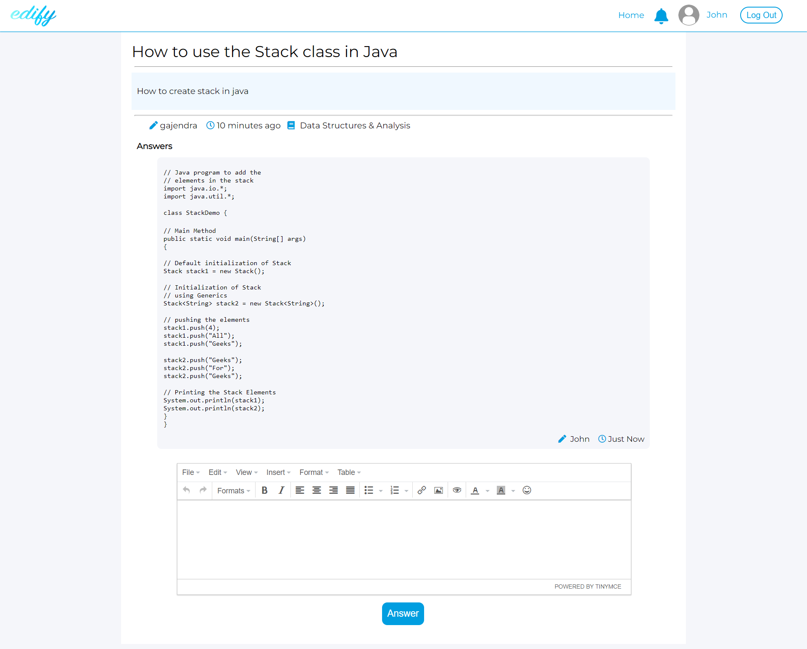

# Edify - An Online Question Answer Forum for College Students

Edify is a question and answer website for college students. Students can register according to their enrolled courses and semester and ask questions on a wide range of topics or give answers to questions asked by peers.

## Tech Stack

**Client:** HTML, CSS

**Server:** Php

**Database:** MySQL

## Run Locally
Download and extract the project zip file

move "edify" folder to "C:/xampp/htdocs" directory

To setup database import "edify.sql" from "Database" folder in php myadmin

To send forgot password emails, insert your email address and password in "forget.inc.php" file

enable "Less secure app access" with your inserted email to send emails 
https://myaccount.google.com/lesssecureapps

Go to : http://localhost/edify

## Screenshots

